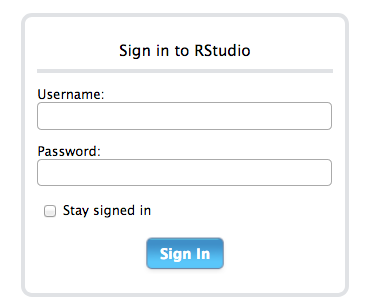
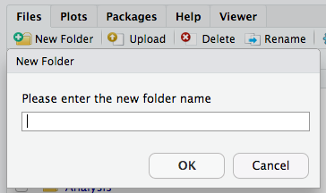

<h2>What is RStudio ?</h2>

* Free and open source IDE (Integrated Development Environment) for R

* Available for Windows, Mac OS and LINUX

<h2>RStudio access</h2>
* [RStudio Desktop installation](https://www.rstudio.com/products/rstudio/download)

* [RStudio access from the CRG server](http://rstudio.linux.crg.es/)
	+ Access with CRG credentials
	+ For those who don't have access to the CRG server, use the guest accounts.

<h2>RStudio interface</h2>
* 4 panels:
	+ top-left: scripts and files
	+ bottom-left: R terminal
	+ top-right: objects, history and environment
	+ bottom-right: tree of folders, graph window, packages, help window, viewer

<h2>Setting up the folder structure for the course</h2>
Rcourse 
  |-Module1 
  |-Module2 
  |-Module3 
  |-Module4 

 > Go to [Paths and directories](https://sarahbonnin.github.io/CRG_RIntroduction/pathdirectories)
 
> [back to home page](https://sarahbonnin.github.io/CRG_RIntroduction)

